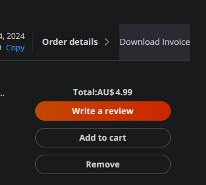

# AliExpress-Invoice-Downloader

### [Install userscript](https://github.com/peter-tanner/AliExpress-Invoice-Downloader/raw/master/AliExpress-Invoice-Downloader.user.js)

### [Mirror (Greasyfork)](https://greasyfork.org/en/scripts/488177-aliexpress-invoice-downloader)

Adds download buttons to the Aliexpress order page (https://www.aliexpress.com/p/order/index.html) and a bulk download button to download all invoices on the order page to save time.

Adds a red "download all invoices" button in the bottom left corner

Adds a button to each order to download individual invoices quickly without needing to open the "order details" page

